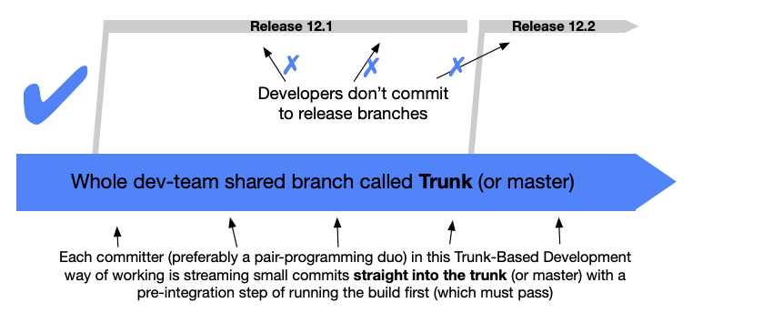
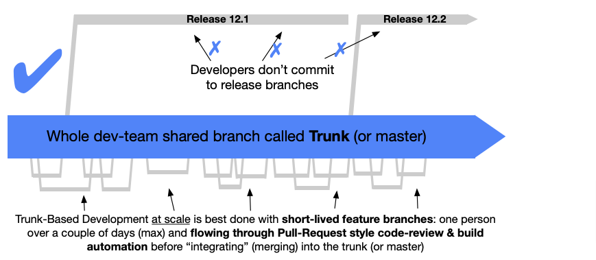

# Python Project Structure Guide

This document outlines the basic structure for a Python project.

Following this structure is recommended for consistency and maintainability, but it is not strictly enforced.


<br>


## Setup Commands

1. **Create a Virtual Environment**: 
   - In the project folder, create a virtual environment to keep dependencies isolated and avoid conflicts with global packages.
   - Command:
     ```sh
     python -m venv .venv
     ```

2. **Install Development Dependencies**: 
   - Install dependencies listed in `requirements-dev.txt`, which should include both core and development packages (e.g., testing, linting, formatting tools).
   - Command:
     ```sh
     pip install -r requirements-dev.txt
     ```

3. **Set Up Pre-commit Hooks**: 
   - Pre-commit hooks are scripts that run checks before each commit to ensure code quality and formatting standards are met. Running these commands will:
     - Install hooks for automatic checks at each commit.
     - Update hooks to their latest versions.
   - Commands:
     ```sh
     pre-commit install
     pre-commit autoupdate
     ```
   - Pre-commit tools include:
     - **codespell** for typos.
     - **ruff lint** for code quality checks.
     - **ruff format** for consistent code formatting.


<br>


## Git Rules

### Branching Strategy - Trunk-Based Development (Hybrid Model)

- **For `Project Leads` and `Experienced Seniors`**: 
  - Use trunk-based development (i.e., work directly on the `main` branch) for fast-paced project needs.
  - For larger features, developers can opt to create feature branches for modular development without impacting the main branch directly.


  
- **For `Mediors` and `Juniors`**:
  - Always create feature branches and submit pull requests for code review before merging into `main`.
  - **Feature Branch Duration**: Feature branches should be short-lived (no more than a few days). If a branch takes longer, it may indicate:
    - The task is too complex and should be broken down into smaller features.
    - The task could be split across multiple developers.



- **Release Tags and Hotfixes**:
  - When code is ready for release, tag the `main` branch with a version number for tracking.
  - In urgent situations requiring hotfixes, mediors and juniors are permitted to commit directly to `main`.

### Commit Message Guidelines

Using a consistent format for commit messages ensures clarity and traceability. The following table provides guidelines for structured commit messages:

| Type      | Description                                                                                       | Example                                   |
|-----------|---------------------------------------------------------------------------------------------------|-------------------------------------------|
| `feat`    | Introduces a new feature.                                                                         | `feat: add user authentication`           |
| `fix`     | Fixes a bug or issue in the code.                                                                 | `fix: correct login validation`           |
| `docs`    | Updates documentation only (no code changes).                                                     | `docs: update README with API usage`      |
| `style`   | Changes related to formatting and whitespace (no logic changes).                                  | `style: reformat code for readability`    |
| `refactor`| Refactors code without adding features or fixing bugs.                                            | `refactor: simplify login logic`          |
| `perf`    | Improves performance in some aspect of the code.                                                  | `perf: optimize database queries`         |
| `test`    | Adds or updates tests.                                                                            | `test: add tests for user model`          |
| `chore`   | Updates build process, dependencies, or auxiliary tasks.                                          | `chore: update npm dependencies`          |

This structure promotes code quality, efficient collaboration, and project organization for long-term maintainability.


<br>


## Tool Configurations in `pyproject.toml`
The configurations for tools like **pytest**, **codespell**, and **ruff** are set in the `pyproject.toml` file. This file centralizes project settings for testing, spell-checking, and linting, ensuring consistency across the team.

### Key Configurations

- **pytest**: Adds code coverage options.
- **codespell**: Specifies patterns to ignore, such as URLs, to avoid unnecessary spell-check warnings.
- **ruff**: Enforces a variety of code checks, including:
  - **Line length**: Currently set to 130 characters.
  - **Exclusions**: Directories like `.venv`, `.conda`, and `tests` are ignored.
  - **Linting rules**: Selects specific rules for code quality, style, and formatting. Some docstring and annotation rules are also ignored.

### Customizing Rules

To disable or modify specific rules:
- **Update `select`**: Add or remove specific checks based on project needs.
- **Adjust `ignore`**: Disable specific rules, such as docstring or annotation requirements, by adding them to the `ignore` list in `pyproject.toml`.

This setup offers flexibility to maintain high standards while accommodating project-specific requirements.
